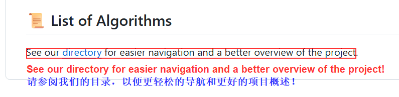

# OCR-Translate-Sketch: A Real-time Screen Translation Tool

[简体中文](./README.zh.md)

> **Note**: This document is translated by AI. For the original version, please see the [Chinese README](./README.zh.md).

[](https://github.com/KIDLi1412/OCR-Translate-Sketch/blob/master/LICENSE)

**OCR-Translate-Sketch** is a real-time screen OCR translation tool built for learning and exploration purposes.

> ⚠️ **Important Note**
>
> This is a personal learning project intended as a Proof of Concept. It is not a stable, precise, production-ready tool and may not work correctly in many scenarios. Please try it with a mindset of exploration and discussion.

## ✨ Project Motivation

Have you ever had this frustration: when playing games, watching foreign language videos, or reading documents, you encounter words or sentences you don't know? Frequently switching apps to look up words or translate not only breaks the immersive experience but is also highly inefficient.

I wanted a tool where I could just hover my mouse over an area of the screen and immediately get the recognition and translation results. **OCR-Translate-Sketch** was born for this purpose.

Ideal Result Screenshot:



## 🚀 What Can It Do?

*   **Real-time Screen Capture**: Captures the screen and performs basic image preprocessing.
*   **Accurate Text Recognition**: Calls the Tesseract OCR engine for text recognition (defaults to English).
*   **Instant Translation**: Integrates the `googletrans` library to translate recognized English text into Chinese, with built-in caching and retry mechanisms to improve the experience.
*   **Floating Window Display**: Displays recognition and translation results in a transparent, always-on-top floating layer.
*   **Hotkey Control**: Easily control the program's stop and mode switching via global hotkeys.
*   **System Tray**: Provides a system tray icon for convenient exit and settings operations.

### Installation and Running (uv recommended)

uv is an extremely fast Python package manager that provides a smoother development experience.

1. Clone the project code
    ```bash
    git clone https://github.com/KIDLi1412/OCR-Translate-Sketch.git
    cd OCR-Translate-Sketch
    ```

2. Install uv (if not already installed)

    Please refer to the official documentation: https://github.com/astral-sh/uv

3. Create a virtual environment and install project dependencies
    ```bash
    uv sync
    ```
4. Start the program
    ```bash
    uv run python src/main.py
    ```

### Other Ways to Run
Please refer to the usage instructions for your specific tool regarding `pyproject.toml`.

## ⚙️ Configuration

All configuration options are located in the `config.yaml` file in the root directory. You can modify it according to your needs.

**Key Configuration Items:**

```yaml
# Path to the Tesseract-OCR executable (Windows example), be sure to change it to your actual installation path
TESSERACT_CMD: D:/Program Files/Tesseract-OCR/tesseract.exe

# OCR recognition language, make sure you have installed the corresponding Tesseract language pack
OCR_LANGUAGE: eng

# Hotkey to stop/start the program
STOP_HOTKEY: <alt>+c

# Hotkey to toggle translation display
TRANSLATION_HOTKEY: <alt>+t

# Master switch for the translation feature
TRANSLATION_ENABLED: true

# Target and source languages for translation
TRANSLATION_TARGET_LANG: zh-cn
TRANSLATION_SOURCE_LANG: en
```

*   `TESSERACT_CMD`: **You must modify this item on first use** to point to the Tesseract installation location on your computer.
*   `OCR_LANGUAGE`: If you need to recognize other languages, please first install the corresponding Tesseract language data packs.
*   `*_HOTKEY`: You can customize your favorite hotkeys.
*   Other translation-related parameters are for tuning cache and retry strategies and usually do not need to be changed.

For more detailed configuration instructions, please refer to CONFIG.md.

## 🕹️ How to Use

1.  Run `src/main.py` to start the program.
2.  The program will create a transparent, always-on-top window that covers the entire screen.
3.  By default, the program will recognize screen content at a set frequency and display the results in real-time on the floating layer.
4.  You can use the hotkey set in `config.yaml` to toggle the display of translated content.
5.  You can safely exit the program by right-clicking the system tray icon or using the configured stop hotkey.

## 🚧 Known Limitations

As a learning project, it has many imperfections:

*   **Performance Bottlenecks**: Real-time image processing is resource-intensive and may cause lag or stuttering on most devices.
*   **Recognition Accuracy**: The success rate of recognition drops significantly in scenes with low light, blur, complex backgrounds, artistic fonts, handwritten text, or skewed text.
*   **Basic Interaction**: Currently only supports basic recognition and interaction, which is not very smart or flexible.
*   **Translation Quality**: Public translation APIs have limited effectiveness on scattered, unstructured text.
*   **Language Support**: Currently polished mainly for the "English to Chinese" scenario; support for other languages is incomplete.

## 🗺️ Future Roadmap

This project has a long way to go. Here are the planned directions for exploration:

*   **Improve OCR Stability**: Implement manual selection of recognition areas, dynamic threshold adjustment, text skew correction, etc.
*   **Performance Optimization**: Explore strategies like image batch processing, parallel computing, and dynamic downsampling to reduce resource consumption.
*   **Enhance Translation Functionality**: Optimize paragraph aggregation for translation, auto-detect multiple languages, and consider supporting more translation service providers.
*   **Optimize Interaction Experience**: Design a more beautiful and user-friendly floating layer UI and add a graphical settings interface.
*   **Improve Code Quality**: Add more comprehensive unit tests.

## 🤝 How to Contribute

All forms of contribution are welcome to make this little tool better!

You can get involved in the following ways:

*   **Submit an Issue**: Report bugs, suggest improvements.
*   **Create a Pull Request**: Fix known issues, develop new features.
*   **Share Your Ideas**: Discuss new technical solutions or application scenarios.

Help in the following areas is particularly welcome:

*   Optimizing performance and stability.
*   Improving algorithms to increase OCR recognition rates.
*   Designing a more modern and friendly user interface.
*   Expanding support for more languages.

## 📜 License

This project is open-sourced under the **MIT License**.

## 🙏 Acknowledgements

*   **Tesseract OCR**: A powerful open-source OCR engine.
*   **googletrans**: A convenient Google Translate API library.
*   And all the open-source communities that gave me inspiration and help during development.
